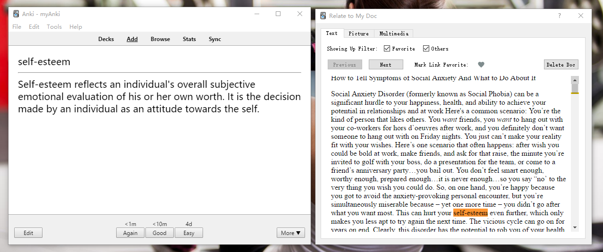

**Show the related text/picture/audio/video documents pre-stored in local database or local file, by a simple search.**

## Quick Start Guide:

1. Menu "Tool" -> "Relate to My Doc" -> "Set NoteType to Relate", select note types,  on which types of cards you would like the add-on to should related documents.
2. Build you text/picture/audio/video documents in local database or local file as you like:
    -- "Tool" -> "Relate to My Doc" -> "Load from Feed", you can a. input text manually, b. load from local text files to local DB, c. add RSS feed address and sync content.
    -- "Tool" -> "Relate to My Doc" -> "Set Pic Directory", specify which folders you would like the add-on to search pictures
    -- "Tool" -> "Relate to My Doc" -> "Manage Multimedia Subs" -> "Load Multimedia Subs", load *.lrc and *.srt files in to local DB, with media files in the same directory
3. Review your cards as usual. The add-on window will show up if you are reviewing card with set note type.

## Instructions:

0. DB refers to add-on DB in add-on folder. It is not the anki db. This add-on would not read/change any data from anki DB
1. Question Words will be searched, in text fields of text documents, in file names of pictures and in audio lyrics and video subtitles
2. Before search, below strings will be excluded: a. media marks like "[xxx.mp3]", b. html elements, like "<div...>", c. cloze indication, from "{{1::foo}}" to "foo".
3. If you want to use key words which you don't want to show up in question. Do it like 
foo

4. Text file to load could be in plain text or html, but the encoding should be utf-8
5. In "Tool" -> "Add-ons" -> select the add on -> "Config", there is an option "sync_feed_on_start". You can set it to true if you'd like to auto-start sync at start up.
6. "clean_favorite_docs_over_n_days" and "clean_normal_docs_over_n_days" are numbers to use in "Clean Aged Data", which only apply to text documents.
7. Set pic directory can be done via UI, or editing config file. They are identical. Picture formats in *.jpg, *.png, *.gif are acceptable.
8. To enable media search. *.srt and *.lrc should be loaded into local DB. The media files should be in the same directory with identical file name but different extension. *.srt and *.lrc files should be in utf-8 encoding.Check "Tool" -> "Relate to My Doc" -> "Manage Multimedia Subs" -> "Instructions" for more information.
9. For audio, only *.mp3 file would be searched. For video, search first found: *.mp4, *.mkv, *.avi, *.flv, *.m4v, *.f4v.
10. "Tool" -> "Relate to My Doc" -> "Manage Multimedia Subs" -> "Clean Subs DB vs Media Files", each sub record in DB will be check against the media file. If the media file is unavailable, the sub record will get deleted.

## Source Code

1. Source code can be found on https://github.com/tosimplicity/AnkiRelateToMyDoc
2. This add-on is licensed under GPL v3, or higher
3. FeedParser is packaged inside unchanged. Link: https://github.com/kurtmckee/feedparser
4. Beautiful Soup is packaged inside unchanged. Link: http://www.crummy.com/software/BeautifulSoup/